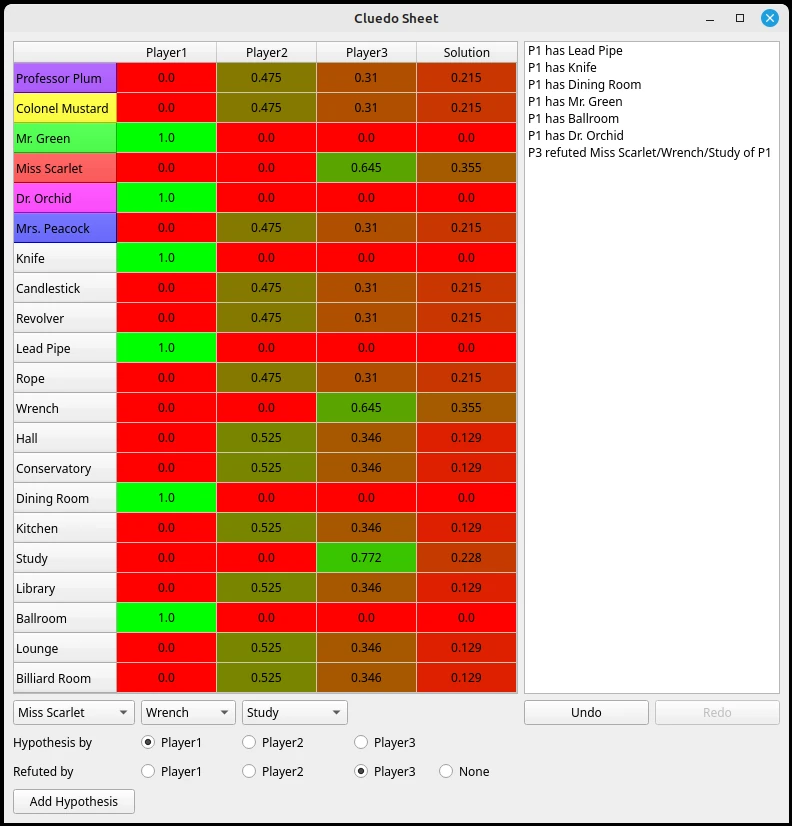

# Cluedo_Sheet
An interactive sheet for Cluedo, that calculates card probabilities automatically.

## Usage
Install requirements in requirements.txt and run Cluedo_Sheet.py script.

### Adding know cards
Right click on a cell and "Add card".

### Adding hypothesis knowledge
Select suspect/weapon/room cards, hypothesis player and refuting player then press "Add hypothesis".
If a player shows you a card right click "Add Card" the relevant cell.

You can also click row and column names on the sheet to change the suspect/weapon/room cards and hypothesis player.

### Undo/Redo
You can undo the last information you've added by pressing "Undo". You can redo the last information you have undone by pressing "Redo".
You can also right click "Remove" any information in the list.

## Probability calculation
There are 3 ways I know of to calculate the probabilities.

### #Sat
There are 21 cards, N players's hands and the solution envelope. If we picture the cluedo sheet, including the envelope's cards, we have a matrix of boolean variables that must obey the following equations:
* The sum of every row is 1 (each card can only be in one player's hands or in the envelope)
* The sum of every player column is that player's numbers of cards (each player has an exactly know number of cards)
* The sum of the envelope column's first 6 cells is 1 (there is exactly 1 suspect card in the envelope)
* The sum of the envelope column's next 6 cells is 1 (there is exactly 1 weapon card in the envelope)
* The sum of the envelope column's last 9 cells is 1 (there is exactly 1 room card in the envelope)
* If a player passed on a hypothesis, those cells are 0
* If a player refuted a hypothesis, the sum of those cells >=1
* If a player showed you a card, that cell ==1
* For the cards in your hand, that cell ==1

This can be viewed as a boolean satisfiability problem. Using a "sat-solver" we can find a solution to these constraints. But what we are interested in, is producing all solutions and counting the percentage of which include each card. This method is **exact** but it is a so-called #Sat problem which is known to be computationally very expensive.

We use this method towards the end of the game when very few possible card permutations remain.

### Analytical center
We can view the problem slightly differently. If we no longer require the variables to be booleans, but instead floats [0,1], representing probabilities. The constraints we listed geometrically give us a "feasible region" and we can calculate the average value of those floats by finding the ["analytical center of the feasible region"](https://www.cs.cmu.edu/~ggordon/10725-F12/scribes/10725_Lecture22.pdf). This requires optimising a sum of logs. Fortunately that function is convex when the variables are >0 and we can use a convex solver.
The way we implement it here is to reformulate all inequalities as equalities using [slack variables](https://en.wikipedia.org/wiki/Slack_variable) and minimizing $\sum_{i}\log{x_{i}}$ where $x_{i}$ is the vector of all our variables, including slack variables given all the constraints.

This method is very fast. However, the results are approximate. This method reasons in terms of volumes of feasibility whereas in reality what matters are specific points in that volume, as we discussed in the #Sat section. The real problem is discrete and here we are treating the problem as continous. Therefore as we get nearer to the end of the game, and fewer and fewer card permutations obey the constraints, our continuous approximation becomes less precise.

We use this method throughout the game as the quality of the approximation seems very good and we do not have a better alternative.

### Monte Carlo draws
In a 3 player game there are 6x6x9x3^18 (~125 billion) ways of distributing the cards. One can sample card permutations, and among the ones that obey the constraints, we can count the frequency of every card being in a given player's hands or being in the solution envelope. This is an unbiased estimator of the true probabilities. However, if we consider an end-game scenario where there are 5 possible card permutations, this method is **extremely** unlikely to land on any hands which obey the constraints.

One way to mitigate would be to only sample where the distribution has support (where card probabilities>0) but one has to be wary not to introduce bias and we have not tested if this is enough to estimate the probabilities fast enough.